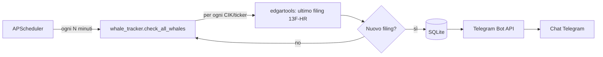

# 🐋 Whale Alert

Monitora i **filing 13F** dei grandi investitori istituzionali ("balene") depositati alla SEC e invia **notifiche automatiche su Telegram** quando rileva nuove posizioni, chiusure o variazioni rilevanti nel loro portafoglio.

## Indice

- [Come funziona](#come-funziona)
- [Stack tecnologico](#stack-tecnologico)
- [Struttura del progetto](#struttura-del-progetto)
- [Prerequisiti](#prerequisiti)
- [Installazione](#installazione)
- [Configurazione](#configurazione)
- [Documentazione whale CIK](docs/whale-ciks.md)
- [Avvio](#avvio)
- [API disponibili](#api-disponibili)
- [Test e qualità del codice](#test-e-qualità-del-codice)
- [Note e limitazioni](#note-e-limitazioni)

## Come funziona



1. Alla partenza dell'app, [`app/scheduler.py`](backend/app/scheduler.py) registra un job periodico (`check_all_whales`) con **APScheduler**, eseguito subito e poi ogni `POLL_INTERVAL_MINUTES`.
2. Per ogni CIK/ticker configurato in `WHALE_CIKS`, [`app/whale_tracker.py`](backend/app/whale_tracker.py) usa **edgartools** per scaricare l'ultimo filing 13F-HR dalla SEC EDGAR, estrarre le top 10 posizioni e calcolare le variazioni rispetto al filing precedente (nuove posizioni, chiusure, incrementi, decrementi).
3. Se l'`accession_number` del filing è diverso dall'ultimo salvato, il filing viene persistito su **SQLite** ([`app/database.py`](backend/app/database.py)) e viene inviata una notifica formattata via **Telegram** ([`app/telegram_notifier.py`](backend/app/telegram_notifier.py)).
4. **FastAPI** ([`app/main.py`](backend/app/main.py)) espone alcuni endpoint REST per consultare lo stato e lo storico dei filing rilevati.

## Stack tecnologico

| Componente | Libreria | Ruolo |
|---|---|---|
| Web framework | [FastAPI](https://fastapi.tiangolo.com/) + [Uvicorn](https://www.uvicorn.org/) | Espone l'API REST e gestisce il ciclo di vita dell'app |
| Scheduler | [APScheduler](https://apscheduler.readthedocs.io/) | Esegue il polling periodico dei filing SEC |
| Dati SEC | [edgartools](https://github.com/dgunning/edgartools) | Scarica e parsa i filing 13F-HR da SEC EDGAR |
| Notifiche | [python-telegram-bot](https://python-telegram-bot.org/) | Invia i messaggi di alert su Telegram |
| Configurazione | [pydantic-settings](https://docs.pydantic.dev/latest/concepts/pydantic_settings/) | Carica le impostazioni da variabili d'ambiente / file `.env` |
| Persistenza | `sqlite3` (stdlib) | Traccia l'ultimo filing visto per ogni whale, senza ORM |
| Qualità codice | pytest, mypy (strict), ruff, black | Test automatici, type-checking, linting, formattazione |

## Struttura del progetto

```
whale_alert/
├── backend/
│   ├── app/
│   │   ├── main.py               # Entry point FastAPI + lifecycle (lifespan)
│   │   ├── config.py             # Settings (env vars / .env) via pydantic-settings
│   │   ├── models.py             # Dataclass: Holding, HoldingMove, WhaleFilingSnapshot
│   │   ├── database.py           # Persistenza SQLite (init/get/save/list filing)
│   │   ├── scheduler.py          # Setup job periodico APScheduler
│   │   ├── whale_tracker.py      # Logica di business: fetch 13F + confronto + notifica
│   │   └── telegram_notifier.py  # Invio messaggi Telegram
│   ├── tests/                    # Test pytest (models, database, config)
│   ├── requirements.txt          # Dipendenze Python
│   ├── pyproject.toml            # Config pytest / mypy / ruff / black
│   ├── .env.example              # Template variabili d'ambiente
│   └── .env                      # Variabili d'ambiente reali (NON committare)
└── README.md
```

## Prerequisiti

- **Python 3.13 o superiore** (testato con 3.13.11)
- Un **bot Telegram**: crealo parlando con [@BotFather](https://t.me/BotFather) su Telegram, che ti fornirà il `TELEGRAM_BOT_TOKEN` (formato `123456789:AAxxxxxxxxxxxxxxxxxxxxxxxxxxxxxxxxx`)
- Il tuo **chat_id** Telegram numerico (vedi sezione [Configurazione](#configurazione))
- Una **email valida** da usare come identità per le richieste a SEC EDGAR (richiesta dalla policy SEC, non serve un vero account)

## Installazione

Windows PowerShell:

```powershell
cd backend
py -3.13 -m venv .venv
.\.venv\Scripts\python.exe -m pip install -r requirements.txt
```

Linux/macOS:

```bash
cd backend
python3 -m venv .venv
.venv/bin/python -m pip install -r requirements.txt
```

> ⚠️ Esegui sempre i comandi Python usando l'interprete del venv dalla cartella `backend/`: `\.venv\Scripts\python.exe` su Windows oppure `.venv/bin/python` su Linux/macOS. Assicurati di non trovarti in `backend/app/` né di usare un venv diverso creato alla radice del progetto.

## Configurazione

Copia il template e compila i valori reali.

Windows PowerShell:

```powershell
cd backend
Copy-Item .env.example .env
```

Linux/macOS:

```bash
cd backend
cp .env.example .env
```

Contenuto di `backend/.env`:

```dotenv
TELEGRAM_BOT_TOKEN=123456789:AAxxxxxxxxxxxxxxxxxxxxxxxxxxxxxxxxx
TELEGRAM_CHAT_ID=123456789
SEC_IDENTITY_EMAIL=you@example.com
WHALE_CIKS=BRK.A,0001067983
POLL_INTERVAL_MINUTES=60
DATABASE_PATH=whale_alert.db
```

| Variabile | Descrizione |
|---|---|
| `TELEGRAM_BOT_TOKEN` | Token del bot ottenuto da BotFather, nel formato `<id>:<hash>` |
| `TELEGRAM_CHAT_ID` | ID numerico della chat Telegram a cui inviare gli alert (**non** lo username del bot) |
| `SEC_IDENTITY_EMAIL` | Email usata come "identità" per le chiamate a SEC EDGAR (richiesto da edgartools/SEC) |
| `WHALE_CIKS` | Lista di ticker o CIK separati da virgola degli investitori da monitorare (es. `BRK.A,0001067983`) |
| `POLL_INTERVAL_MINUTES` | Intervallo in minuti tra un controllo e l'altro (default `60`) |
| `DATABASE_PATH` | Percorso del file SQLite dove salvare i filing rilevati |

### Come funziona `WHALE_CIKS`

`WHALE_CIKS` indica quali investitori istituzionali monitorare. Il nome della
variabile è storico: ogni elemento può essere un **ticker** oppure un **CIK
SEC** numerico, non necessariamente un CIK.

```dotenv
WHALE_CIKS=BRK.A,0001067983
```

Gli elementi sono separati da virgole e gli spazi vuoti vengono rimossi. Per
esempio, la configurazione precedente crea due elementi:

- `BRK.A`: ticker di Berkshire Hathaway Inc.;
- `0001067983`: CIK SEC numerico di Berkshire Hathaway Inc.

È preferibile usare il CIK numerico quando lo si conosce, perché identifica
direttamente il soggetto nei sistemi SEC. Il ticker è comunque supportato da
`edgartools`, che lo risolve verso la società corrispondente.

Per ogni elemento, il controllo segue questo flusso:

1. L'applicazione crea un client SEC per l'identificativo configurato e cerca i
    filing con modulo `13F-HR`.
2. Se esiste un filing, seleziona quello più recente e legge il relativo
    prospetto delle partecipazioni (`information table`). Se il filing non ha
    una tabella valida, viene ignorato.
3. Le partecipazioni vengono ordinate per valore e le prime 10 vengono salvate
    nello snapshot. Viene inoltre calcolato il confronto con il filing
    precedente: nuove posizioni, posizioni chiuse, incrementi e decrementi.
4. L'app confronta l'`accession_number` del filing con l'ultimo accession
    salvato in SQLite. Se è uguale, il filing è già noto e non viene inviata
    alcuna notifica.
5. Se è diverso, salva lo snapshot nel database e invia l'alert Telegram. Il
    primo filing mai visto per una whale viene trattato come `first seen`.

Il controllo viene eseguito immediatamente all'avvio dell'app e poi ogni
`POLL_INTERVAL_MINUTES` minuti. Se SEC o il parsing falliscono per una whale,
l'errore viene registrato nei log e il controllo prosegue sulle altre whale.

Per verificare gli identificativi attualmente configurati:

```text
GET http://127.0.0.1:8000/whales
```

Per consultare lo storico di una whale configurata:

```text
GET http://127.0.0.1:8000/whales/0001067983/filings?limit=10
```

### Come ottenere il tuo `TELEGRAM_CHAT_ID`

1. Avvia una conversazione col tuo bot su Telegram e invia un messaggio qualsiasi.
2. Apri nel browser (sostituendo `<TOKEN>` col tuo bot token):
   ```
   https://api.telegram.org/bot<TOKEN>/getUpdates
   ```
3. Cerca il campo `"chat":{"id": ...}` nella risposta JSON: quel numero è il tuo `TELEGRAM_CHAT_ID`.

> 🔒 **Sicurezza**: non condividere mai il bot token pubblicamente; chi lo possiede può controllare il bot. Il file `.env` è escluso da git tramite `.gitignore`.

## Avvio

Dalla cartella `backend/`, avvia il server con il venv.

Windows PowerShell:

```powershell
cd backend
.\.venv\Scripts\python.exe -m uvicorn app.main:app --reload --reload-dir app
```

Linux/macOS:

```bash
cd backend
.venv/bin/python -m uvicorn app.main:app --reload --reload-dir app
```

L'app sarà disponibile su `http://127.0.0.1:8000`.

> 💡 Usa sempre `--reload-dir app` insieme a `--reload`. Senza questa opzione, uvicorn monitora **tutta** la cartella `backend/`, incluso `.venv/`: se il progetto è sincronizzato con OneDrive, i timestamp dei pacchetti installati vengono toccati di continuo, causando riavvii continui e spuri del server.

All'avvio, i log confermano che tutto è partito correttamente:

```
INFO:     Will watch for changes in these directories: ['...\backend\app']
INFO:edgar.settings:Identity of the Edgar REST client set to [you@example.com]
INFO:apscheduler.scheduler:Scheduler started
INFO:app.main:Whale alert scheduler started (every 60 min) for 2 whale(s)
INFO:     Application startup complete.
```

## API disponibili

> ℹ️ Non esiste una route su `/` (root): visitare `http://127.0.0.1:8000/` restituisce volutamente `{"detail":"Not Found"}`. Usa uno degli endpoint elencati sotto.

| Metodo | Endpoint | Descrizione |
|---|---|---|
| `GET` | `/health` | Endpoint di liveness, ritorna `{"status": "ok"}` |
| `GET` | `/whales` | Elenca i CIK/ticker attualmente monitorati |
| `GET` | `/whales/{cik}/filings?limit=10` | Ritorna gli ultimi filing rilevati per una whale specifica |

Documentazione interattiva (Swagger UI) disponibile su `http://127.0.0.1:8000/docs` a server avviato.

## Test e qualità del codice

Windows PowerShell:

```powershell
cd backend
.\.venv\Scripts\python.exe -m pytest -q          # Test automatici
.\.venv\Scripts\python.exe -m mypy app tests     # Type-checking strict
.\.venv\Scripts\python.exe -m ruff check .       # Linting
.\.venv\Scripts\python.exe -m black .            # Formattazione
```

Linux/macOS:

```bash
cd backend
.venv/bin/python -m pytest -q          # Test automatici
.venv/bin/python -m mypy app tests     # Type-checking strict
.venv/bin/python -m ruff check .       # Linting
.venv/bin/python -m black .            # Formattazione
```

## Note e limitazioni

- **Reti aziendali con SSL inspection/proxy** possono bloccare l'handshake TLS verso `api.telegram.org`, impedendo l'invio delle notifiche pur senza far crashare l'app (l'errore viene loggato e gestito). Se ti trovi in questa situazione, prova da una rete diversa o richiedi un'eccezione all'IT.
- `WHALE_CIKS` accetta sia ticker (es. `BRK.A`) sia CIK numerici SEC (es. `0001067983`).
- Il progetto attualmente copre solo il **backend**; un frontend Svelte per una dashboard web è descritto nell'architettura originale ma non ancora implementato.
