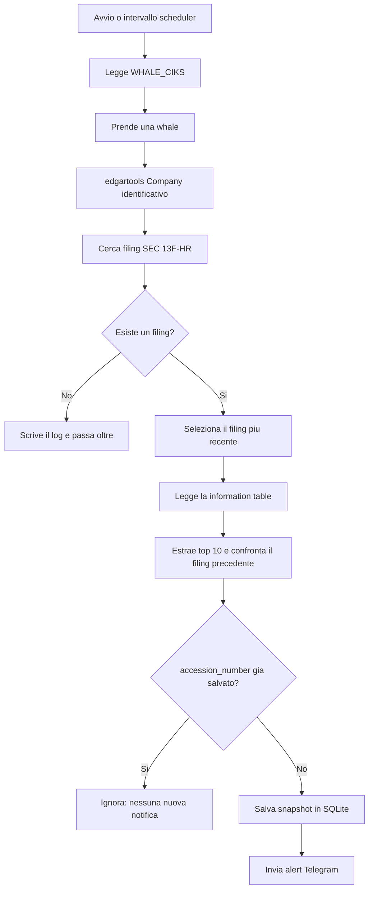

# Monitoraggio delle whale con `WHALE_CIKS`

Questa guida spiega come configurare gli investitori istituzionali da monitorare e come l'applicazione recupera, confronta e notifica i loro filing SEC `13F-HR`.

## Che cosa configura

La variabile `WHALE_CIKS` contiene una lista separata da virgole. Ogni elemento può essere:

- un **CIK SEC** numerico, che identifica direttamente una società nei sistemi SEC;
- un **ticker**, che `edgartools` risolve verso la società corrispondente.

Esempio:

```dotenv
WHALE_CIKS=BRK.A,0001067983
```

Gli spazi intorno agli elementi vengono rimossi. La configurazione precedente viene quindi interpretata come:

```text
["BRK.A", "0001067983"]
```

Quando disponibile, il CIK numerico è preferibile perché è l'identificativo ufficiale SEC e non dipende dal ticker utilizzato sui mercati.

## Configurazione

Il valore va inserito nel file `backend/.env`, insieme all'identità email richiesta dalla SEC:

```dotenv
SEC_IDENTITY_EMAIL=you@example.com
WHALE_CIKS=0001067983,0001364742
POLL_INTERVAL_MINUTES=60
DATABASE_PATH=whale_alert.db
```

Su Windows PowerShell:

```powershell
cd backend
Copy-Item .env.example .env
```

Su Linux/macOS:

```bash
cd backend
cp .env.example .env
```

Non inserire token Telegram reali nei commit o nella documentazione. Il file `.env` deve restare locale.

## Flusso di una verifica

Il controllo viene eseguito subito quando l'applicazione parte e poi a intervalli regolari definiti da `POLL_INTERVAL_MINUTES`.



Per ogni identificativo l'applicazione esegue questi passaggi:

1. Crea un oggetto `edgartools.Company` usando il ticker o il CIK configurato.
2. Cerca i filing con modulo `13F-HR`, cioè i report trimestrali delle partecipazioni istituzionali.
3. Seleziona il filing piu recente. Se non esiste alcun filing, registra l'evento e continua con la whale successiva.
4. Legge la `information table` del filing. Se la tabella non e disponibile, il filing viene ignorato.
5. Ordina le partecipazioni per valore e salva le prime 10 posizioni nello snapshot.
6. Se esiste un report precedente, usa il confronto di `edgartools` per individuare nuove posizioni, chiusure, incrementi e decrementi.
7. Confronta l'`accession_number` con l'ultimo filing salvato per quella whale.
8. Se l'accession e gia presente, non salva nuovamente il filing e non invia un alert.
9. Se l'accession e nuovo, salva lo snapshot in SQLite e invia il messaggio Telegram.

## Perche si usa `accession_number`

L'`accession_number` e l'identificativo univoco assegnato dalla SEC a un filing. Viene usato come chiave pratica per capire se l'app ha gia elaborato quel report:

- stesso accession: il filing e gia stato elaborato;
- accession diverso: il filing e nuovo e deve essere salvato/notificato;
- nessun accession precedente: e il primo filing visto per quella whale.

Il primo filing viene comunque salvato e notificato, ma viene marcato internamente come primo avvistamento (`first seen`).

## Che cosa contiene lo snapshot

Per ogni nuovo filing vengono conservati:

- CIK o ticker usato nella configurazione;
- nome della societa o del gestore;
- `accession_number` e data del filing;
- valore complessivo del portafoglio;
- numero totale di partecipazioni;
- prime 10 partecipazioni per valore, con emittente, ticker, CUSIP, azioni e valore;
- movimenti rilevati rispetto al filing precedente.

La cronologia viene salvata nel database SQLite indicato da `DATABASE_PATH`. Il percorso relativo viene risolto rispetto alla directory da cui viene avviata l'applicazione, normalmente `backend/`.

## Errori e casi senza risultati

Un problema su una singola whale non interrompe il ciclo completo. Errori di rete SEC, errori di parsing o filing non validi vengono registrati nei log; lo scheduler prosegue con gli altri identificativi.

I casi principali sono:

- **nessun `13F-HR`**: nessuno snapshot e nessuna notifica;
- **information table assente**: filing ignorato;
- **filing gia elaborato**: nessuna scrittura e nessuna notifica;
- **nuovo filing**: scrittura SQLite e notifica Telegram;
- **errore SEC o parsing**: log dell'errore e prosecuzione sulle altre whale.

## API di verifica

Elenco degli identificativi configurati:

```http
GET http://127.0.0.1:8000/whales
```

Risposta di esempio:

```json
{
  "whales": ["BRK.A", "0001067983"]
}
```

Storico dei filing di una whale:

```http
GET http://127.0.0.1:8000/whales/0001067983/filings?limit=10
```

La whale richiesta deve essere presente in `WHALE_CIKS`, altrimenti l'API restituisce `404 Whale not tracked`.

## Avvio manuale

Windows PowerShell:

```powershell
cd backend
.\.venv\Scripts\python.exe -m uvicorn app.main:app --reload --reload-dir app
```

Linux/macOS:

```bash
cd backend
.venv/bin/python -m uvicorn app.main:app --reload --reload-dir app
```

I log iniziali mostrano quante whale sono configurate e l'intervallo del polling. Un errore Telegram non significa necessariamente che il recupero SEC sia fallito: controllare separatamente i log `app.whale_tracker` e `app.telegram_notifier`.
